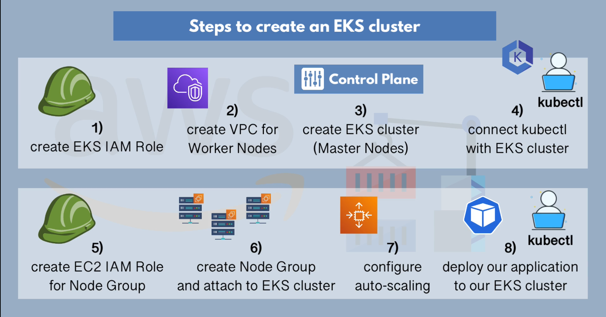

while usin EKS in case U have manage those infrasture ec2 and also connect them to k8s . also can use node group to manage your worker node more easily.

#### Task 1

1. Create a role that have nessacry permision to access the resoucres both in aws and k8s .
2. Create worker nodes using aws iaac https://s3.us-west-2.amazonaws.com/amazon-eks/cloudformation/2020-10-29/amazon-eks-vpc-private-subnets.yamlaw
3. Then create a eks cluster that is managed by aws , with proper iam policy
4. connect the culster using kubectl , by command `<aws eks update-kubeconfig --name cluster-name>`
5. Create Iam role for the node gp so that it can create those ec2 to handel task "cni , worker , container reg"
6. crate node gp with desire vm size
7. use the k8s auto-scaler componet , use the costom policy for the node group and then
8. kubectl apply -f https://raw.githubusercontent.com/kubernetes/autoscaler/master/cluster-autoscaler/cloudprovider/aws/examples/cluster-autoscaler-autodiscover.yaml apply it

###### USIng eksctl  CLI Tool

After the installation it can handle all manual process and WE can use the yaml file to handle the configuration on eks .
