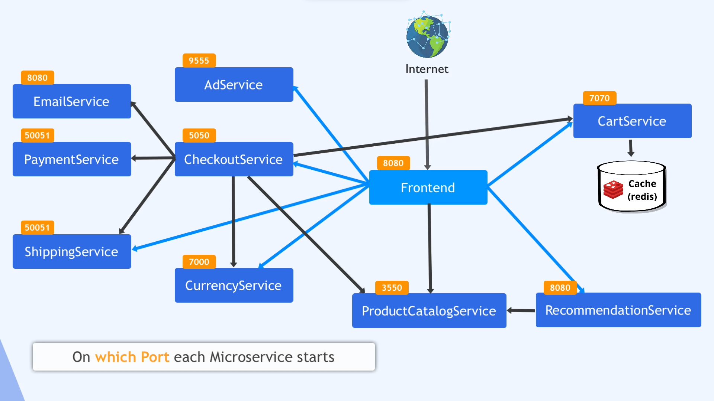

1. How development goes on different ways
   i) Creating deployments and services for each microservice .(using the best practices)
2. we can create helm chart by command " helm create chart `<chart-name>`"
3. whenever we see a similar trend in the deployment we created helm(template) for them , and also the values for each .
4. but we have to type again and again `<helm install -f values/redis-values.yaml rediscart charts/redis>` to deploy a chart ,so we created a helmfile to do the same by mentioning


   "releases:

   - name: rediscart
     chart: charts/redis
     values:
     - values/redis-values.yaml
     - appReplicas: "1"
     - volumeName: "redis-cart-data"

   ```

   ```
